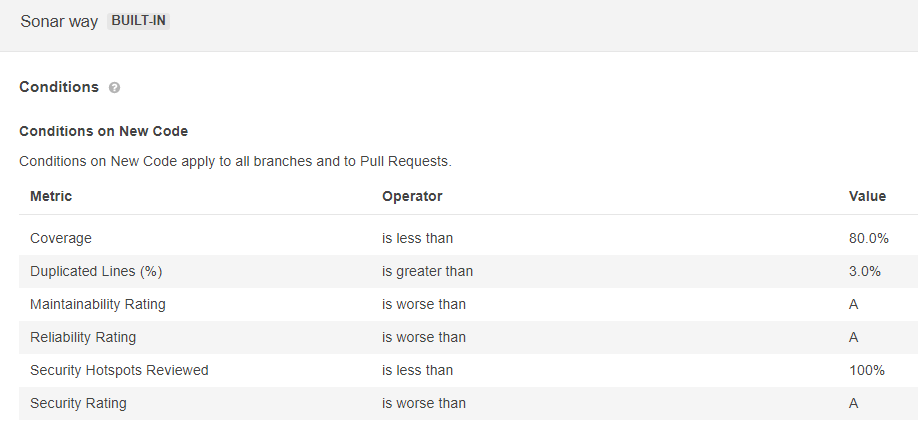

# Node.js API Starter

## Table of contents

- [Project Description](README.md/#project-description)
- [Installation](README.md/#installation)
- [Structure](README.md/#structure)
- [Usage](README.md/#usage)
- [Unit test](README.md/#unittest)
- [References](README.md/#references)

## Project description

Seed repository with all the files and folders necessary to start working on the Node JS application.

## Structure

```bash
├── src
│   ├── bin
│   │   ├── start.js  --> Starting and setup the node-express application and many more like DB connection, telemetry..
│   ├── resources  --> Here include, routes and controllers that manage the application. Generally for each module having a controle, router and model.
│   ├── ├── item --> Example of how to use routers, controllers, and models.
│   ├── ├── ├── itemRouter.js  --> Route that control how an application’s endpoints (URIs) respond to client requests.
│   ├── ├── ├── itemController.js  --> The controller file uses for controlling the flow like calling the service, taking the request and sending the response as well.
│   ├── ├── ├── itemModel.js  --> DB model if DB is required
│   ├── ├── health
│   ├── ├── ├──	HealthRouter.js  --> Endpoint that returns the health of the service.
│   ├──	utils  --> Basically a bunch of functions that help in the internal working of the app.
│   ├──	app.js  --> Express module file that manages http requests and middleware configurations.
├── .env.example --> File that contains and example of how to use the env variables.
├── test  --> Folder where all the unit tests to be used must be included.
│   ├── resources
│   ├── |── health
│   ├── ├── ├── healthController.spec --> unit test for health endpoint
```

## Installation

```bash
npm install
```

Clone the `env.example` file as `.env` and fill it with all your local environment variables.

## Usage

You can run locally your project executing npm restart

```bash
npm run dev
```

Then, open you project in `http://localhost:3000/api`

### Sonar

sonar is used to code quality and security.

the quality gate used for default is "Sonar way":



## Unit Test

command to execute test:

```bash

npm run test
```

- It is highly recommended to use the Given/When/Then unit test naming convention. The idea behind that is to have meaningful test scenarios that could be easy to read. You can check more information [here](https://martinfowler.com/bliki/GivenWhenThen.html).
- It is highly recommended to use the following structure in your unit test files:

	```bash
	describe('File name xxxx', () => {
	describe('Function name xxxx', async () => {
		test('test scenario with GivenWhenThen format ', async () => {
	```

## ESLint

ESLint is a code linter which mainly helps catch quickly minor code quality and style issues.

### ESLint rules

Like most linters, ESLint has a wide set of configurable rules as well as support for custom rule sets.
All rules are configured through `.eslintrc` configuration file.
In this project, we are using a the airbnb set of rules with a few custom rules.

### Running ESLint

Like the rest of our build steps, we use npm scripts to invoke ESLint.
To run ESLint you can call the ESLint task.

```
npm run lint:fix    // runs ESLint and automatically fix problems
```

```
npm run lint    // runs ESLint and generate a report with the issues found
```

If you are interested in seeing ESLint feedback as soon as possible, I strongly recommend the [VS Code ESLint extension](https://marketplace.visualstudio.com/items?itemName=dbaeumer.vscode-eslint).
